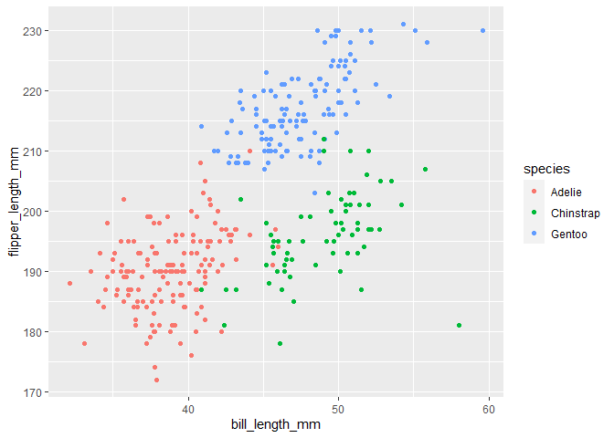

Homework 1
================
Nancy Fang (nf2466)

This is my solution to HW1

``` r
library(tidyverse)
```

    ## -- Attaching packages ------------------------------------------------- tidyverse 1.3.0 --

    ## v ggplot2 3.3.2     v purrr   0.3.4
    ## v tibble  3.0.3     v dplyr   1.0.2
    ## v tidyr   1.1.2     v stringr 1.4.0
    ## v readr   1.3.1     v forcats 0.5.0

    ## -- Conflicts ---------------------------------------------------- tidyverse_conflicts() --
    ## x dplyr::filter() masks stats::filter()
    ## x dplyr::lag()    masks stats::lag()

## Problem 1

``` r
prob1_df =
  tibble (
    samp = rnorm(10),
    samp_gt_0 = samp > 0,
    char_vec = c( "a", "b", "c", "d", "e", "f", "g", "h", "i", "j"),
    factor_vec = factor (c("low", "low", "low", "mod", "mod", "mod", "mod", "high", "high", "high"))
)
```

Take the mean of each variable in my data frame

``` r
mean (pull(prob1_df, samp))
```

    ## [1] -0.2364261

``` r
mean (pull(prob1_df, samp_gt_0))
```

    ## [1] 0.4

``` r
mean (pull(prob1_df, char_vec))
```

    ## Warning in mean.default(pull(prob1_df, char_vec)): argument is not numeric or
    ## logical: returning NA

    ## [1] NA

``` r
mean (pull(prob1_df, factor_vec))
```

    ## Warning in mean.default(pull(prob1_df, factor_vec)): argument is not numeric or
    ## logical: returning NA

    ## [1] NA

I can take the mean of numbers and logical but not character or factor
variables

``` r
as.numeric (pull(prob1_df, samp))
as.numeric (pull(prob1_df, samp_gt_0))
as.numeric (pull(prob1_df, char_vec))
as.numeric (pull(prob1_df, factor_vec))
```

You can convert a factor vector to numeric, but not character vectors to
numeric.

``` r
as.numeric (pull(prob1_df, samp_gt_0))*pull(prob1_df, samp) #convert the logical vector to numeric, and multiply the random sample by the result
```

    ##  [1] 0.00000000 0.00000000 0.99627970 0.21440585 0.00000000 1.77103906
    ##  [7] 0.00000000 0.00000000 0.08650137 0.00000000

``` r
as.factor(pull(prob1_df, samp_gt_0))*pull(prob1_df, samp) #convert the logical vector to a factor, and multiply the random sample by the result
```

    ## Warning in Ops.factor(as.factor(pull(prob1_df, samp_gt_0)), pull(prob1_df, : '*'
    ## not meaningful for factors

    ##  [1] NA NA NA NA NA NA NA NA NA NA

``` r
prob1_factor = 
  as.factor(pull(prob1_df, samp_gt_0)) #convert the logical vector to a factor and naming is prob1_factor

as.numeric (prob1_factor)*pull(prob1_df, samp) # convert the result to numeric, and multiply the random sample by the result
```

    ##  [1] -0.94083134 -0.38265620  1.99255939  0.42881171 -0.08577282  3.54207812
    ##  [7] -1.05593141 -1.25116960  0.17300275 -1.71612512

# Problem 2

``` r
data("penguins", package = "palmerpenguins")
view(penguins)#data variables in the this dataset show there are 3 species of penguins from 3 islands and include variables of bill length, depth, flipper length, body mass, sex, and year.
nrow(penguins) #there are 344 individual inputs (rows)
```

    ## [1] 344

``` r
ncol(penguins) #there are 8 different variables (columns)
```

    ## [1] 8

``` r
#take subset of flipper length > 0 and assign name 'num_flipper'
num_flipper=
  subset(penguins,flipper_length_mm>0,) 
#change 'num_flipper' to numeric
    as.numeric(pull(num_flipper,flipper_length_mm)) 
```

    ##   [1] 181 186 195 193 190 181 195 193 190 186 180 182 191 198 185 195 197 184
    ##  [19] 194 174 180 189 185 180 187 183 187 172 180 178 178 188 184 195 196 190
    ##  [37] 180 181 184 182 195 186 196 185 190 182 179 190 191 186 188 190 200 187
    ##  [55] 191 186 193 181 194 185 195 185 192 184 192 195 188 190 198 190 190 196
    ##  [73] 197 190 195 191 184 187 195 189 196 187 193 191 194 190 189 189 190 202
    ##  [91] 205 185 186 187 208 190 196 178 192 192 203 183 190 193 184 199 190 181
    ## [109] 197 198 191 193 197 191 196 188 199 189 189 187 198 176 202 186 199 191
    ## [127] 195 191 210 190 197 193 199 187 190 191 200 185 193 193 187 188 190 192
    ## [145] 185 190 184 195 193 187 201 211 230 210 218 215 210 211 219 209 215 214
    ## [163] 216 214 213 210 217 210 221 209 222 218 215 213 215 215 215 216 215 210
    ## [181] 220 222 209 207 230 220 220 213 219 208 208 208 225 210 216 222 217 210
    ## [199] 225 213 215 210 220 210 225 217 220 208 220 208 224 208 221 214 231 219
    ## [217] 230 214 229 220 223 216 221 221 217 216 230 209 220 215 223 212 221 212
    ## [235] 224 212 228 218 218 212 230 218 228 212 224 214 226 216 222 203 225 219
    ## [253] 228 215 228 216 215 210 219 208 209 216 229 213 230 217 230 217 222 214
    ## [271] 215 222 212 213 192 196 193 188 197 198 178 197 195 198 193 194 185 201
    ## [289] 190 201 197 181 190 195 181 191 187 193 195 197 200 200 191 205 187 201
    ## [307] 187 203 195 199 195 210 192 205 210 187 196 196 196 201 190 212 187 198
    ## [325] 199 201 193 203 187 197 191 203 202 194 206 189 195 207 202 193 210 198

``` r
#take mean of numerical values of flipper length  
     mean(as.numeric(pull(num_flipper,flipper_length_mm)))
```

    ## [1] 200.9152

``` r
#plot of bill length vs flipper length
  ggplot(penguins, aes(x = bill_length_mm, y = flipper_length_mm)) + geom_point(aes(color=species))
```

    ## Warning: Removed 2 rows containing missing values (geom_point).

<!-- -->

``` r
bill_flipper_plot=
  ggplot(penguins, aes(x = bill_length_mm, y = flipper_length_mm)) + geom_point(aes(color=species))

#save ggplot
ggsave("bill_flipper_plot.pdf", bill_flipper_plot, width=8, height=5)
```

    ## Warning: Removed 2 rows containing missing values (geom_point).
